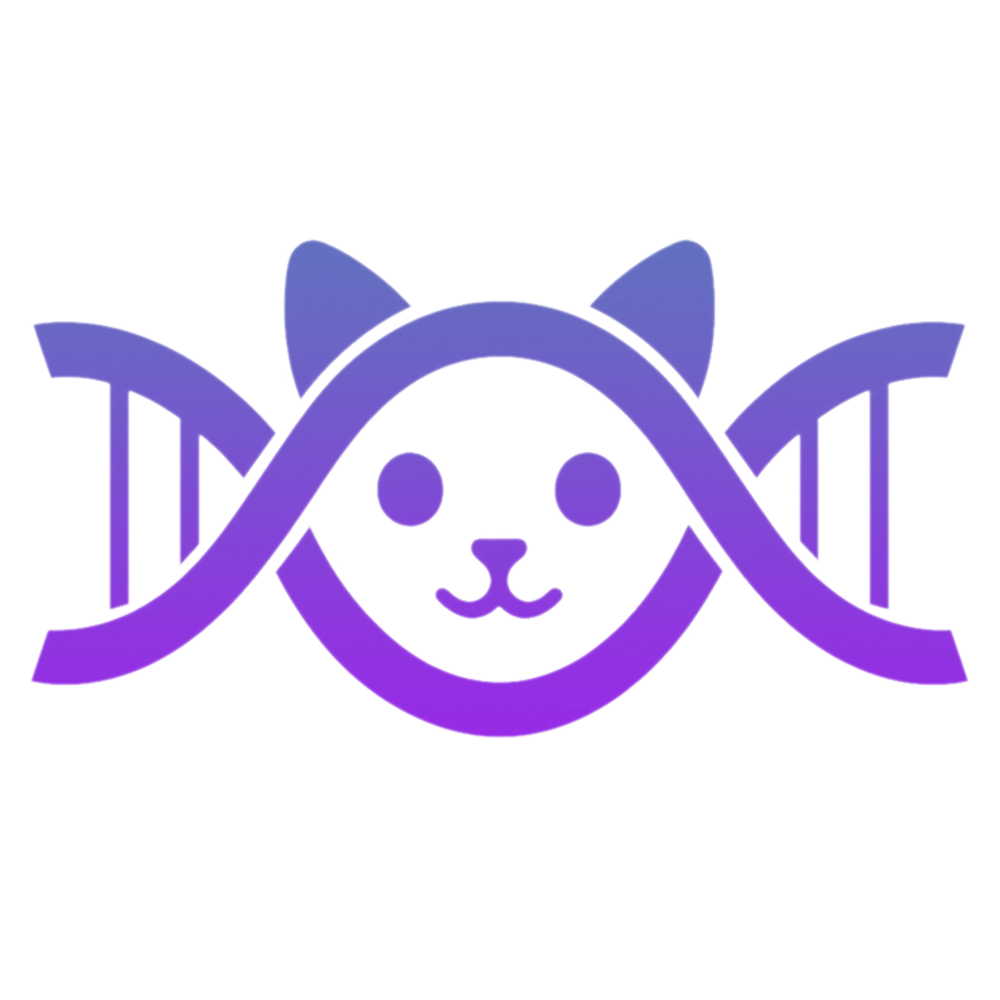

[](https://github.com/copycord/copycord/releases/latest)

_Love this project? Give it a ⭐️ and let others know!_

<p align="left">
  
</p>

**Copycord** is a Discord server cloner, designed to help you clone and synchronize an entire server in real time. By leveraging your user account’s WebSocket connection together with a dedicated bot, Copycord keeps your clone server fully up to date.

> [!IMPORTANT]
> **Features:**
> - Clones host server categories and channels on first run
> - Detects channel renames, position changes, and recreates missing channels on the fly
> - Creates webhooks in all channels used to forward identical messages as they are sent
> - The user account in the host server handles listening; a separate bot handles relaying, minimizing exposure
> - Send DM announcements in realtime to specific users when a message contains a designated keyword
> - Slash commands and community server features
> - Clone entire channel message history 🆕
> - Updated regularly with new feature requests


## How It Works

1. **Listen**  
   Establishes a WebSocket connection using your user token to capture host-server events.

2. **Sync**  
   Compares the live server structure against a local database, then creates, renames, moves, or deletes channels and categories as needed.

3. **Relay**  
   For each new message, sends it via webhook—preserving content, author name, and avatar—in the clone server.


## Getting Started

### Prerequisites

- Docker & Docker Compose  
- Two Discord applications/accounts: one for listening, one for relaying

### Setup

1. **Prepare the clone server**  
   Create a new Discord server to receive mirrored content.  

2. **Obtain your user token**  
   - Log into Discord in a browser with the listening account.  
   - Open Developer Tools (F12 or Ctrl+Shift+I) and run:
      ```js
      const iframe = document.createElement("iframe");
      console.log(
        "Token: %c%s",
        "font-size:16px;",
        JSON.parse(
          document.body.appendChild(iframe).contentWindow.localStorage.token
        )
      );
      iframe.remove();
      ```
   - Copy and store this token securely.

3. **Create and configure the bot**  
   - In the [Discord Developer Portal](https://discord.com/developers/applications), create a new bot.
   - Under **Installation**, set the Install Link to `None` and click save.
   - Under **Bot**, click reset token and store your bot token somewhere secure, disable `Public Bot`, and enable these intents:  
     - `Presence`  
     - `Server Members`  
     - `Message Content`  
   - Under **OAuth2**, generate an invite url with (Scopes: `bot`, Bot Permissions: `Administrator`) and invite the bot to your clone server.

## Configuration

### 1. Create a new folder and add `docker-compose.yml` and `.env` 

In the new folder, create `docker-compose.yml` and `.env`: 

`docker-compose.yml`
```yaml
services:
  server:
    container_name: copycord-server
    image: ghcr.io/copycord/copycord-server:v1.7.0
    env_file:
      - .env
    volumes:
      - ./data:/data
    restart: unless-stopped

  client:
    container_name: copycord-client
    image: ghcr.io/copycord/copycord-client:v1.7.0
    env_file:
      - .env
    volumes:
      - ./data:/data
    depends_on:
      - server
    restart: unless-stopped
```

`.env`
```yaml
SERVER_TOKEN= # Discord bot token
CLONE_GUILD_ID= # ID of the clone guild, bot must be invited to this guild
COMMAND_USERS= # Discord user IDs allowed to use commands separated by commas
DELETE_CHANNELS=True # Delete channels after they are deleted from the host server
DELETE_THREADS=True # Delete threads after they are deleted from the host server
CLONE_EMOJI=True # Clone emojis
CLONE_STICKER=True # Clone stickers

CLIENT_TOKEN= # Your discord account token
HOST_GUILD_ID= # ID of the host guild to monitor
```

### 3. Launch Copycord

Make sure you have Docker & Docker Compose installed, then open a command prompt in the same directory and run:

```bash
docker-compose up -d
```

This will pull the latest images, start both the **server** (bot) and **client** (listener), and mount `./data` for database and logs.
##
### Slash commands
- [Slash Commands Wiki](docs/slash_commands.md)
##

> [!IMPORTANT]
> Copycord uses self‑bot methods (listening via a user token), which violates Discord’s Terms of Service and may result in account termination. Although our two‑step design reduces exposure, **use at your own risk**. We strongly recommend using an alternate account for the listening component.

## Contributing & Support

Feel free to [open an issue](https://github.com/Copycord/Copycord/issues) if you hit any road bumps or want to request new features.

We appreciate all contributions:

1. Fork the repository.  
2. Create a new branch from `main` with a descriptive name.  
3. Commit your changes and open a [Pull Request](https://github.com/copycord/copycord/pulls), detailing your feature or fix.

Thank you for helping improve Copycord!
