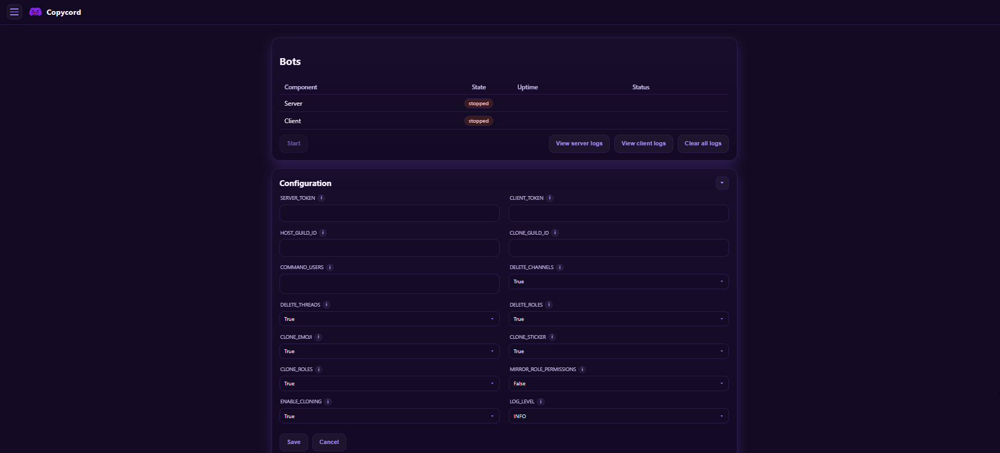

[](https://github.com/copycord/copycord/releases/latest)
[](https://discord.gg/ArFdqrJHBj)

_Love this project? Give it a ⭐️ and let others know!_

<p align="left">
  
</p>


**Copycord** lets you clone and monitor Discord servers in real-time, with a feature-rich slash command system and a sleek, easy-to-use web dashboard.
Easily clone servers, scrape member lists, customize channels, and much more just a few clicks.


> [!IMPORTANT]  
> **✨ Copycord Features**  
> - **Full Server Cloning** – Instantly mirror categories, channels, and message history from any target server—with the option to include roles, emojis, and stickers, all fully controlled through the web UI.
> - **Live Message Forwarding** – Every new message is forwarded in real time to your clone via webhooks, keeping both servers perfectly in sync.  
> - **Dynamic Structure Sync** – Copycord constantly watches for changes in the source server (new channels, renames, role updates) and applies them to your clone automatically.  
> - **Advanced Channel Filtering** – Choose exactly which channels to include or exclude for maximum control over your clone’s layout.  
> - **Custom Branding** – Rename channels, customize webhook names/icons, and make the clone feel like your own personalized community.  
> - **Smart Message Filtering** – Automatically block or drop unwanted messages based on custom keyword rules.  
> - **Member Insights** – Use the built-in member scraper to gather detailed information about guild members.  
> - **Deep History Import** – Clone an entire channel’s message history, not just the new ones.
> - **Real-Time DM Alerts** – Get instant, customizable DM notifications for important messages and events that matter most to you.  
> - **Your Own Bot, Your Rules** – Run a fully independent Discord bot that you control—no restrictions.  
> - **Sleek Web Dashboard** – Manage everything through a modern, easy-to-use web interface. 

## Getting Started

### Prerequisites

- [Docker](https://github.com/Copycord/Copycord/blob/main/docs/Instructions.md)
- Discord Account Token + Discord Bot Token

### Setup

1. **Prepare the clone server**  
   Create a new Discord server to receive mirrored content.  

2. **Obtain your user token**  
   - Log into Discord in a browser with your account.
   - Open Developer Tools (F12 or Ctrl+Shift+I)
   - Enable device emulation mode (Ctrl+Shift+M), then paste the code below into the console and press Enter:
      ```js
      const iframe = document.createElement("iframe");
      console.log(
        "Token: %c%s",
        "font-size:16px;",
        JSON.parse(
          document.body.appendChild(iframe).contentWindow.localStorage.token
        )
      );
      iframe.remove();
      ```
   - Copy and store this token securely.

3. **Create and configure the bot**  
   - In the [Discord Developer Portal](https://discord.com/developers/applications), create a new bot.
   - Under **Installation**, set the Install Link to `None` and click save.
   - Under **Bot**, click reset token and store your bot token somewhere secure, disable `Public Bot`, and enable these intents:  
     - `Presence`  
     - `Server Members`  
     - `Message Content`  
   - Under **OAuth2**, generate an invite url with (Scopes: `bot`, Bot Permissions: `Administrator`) and invite the bot to your clone server.

## Configuration

### 1. Create a copycord folder and add docker-compose.yml
```
copycord/
├── docker-compose.yml # docker compose file
└── data/ # data folder will be created automatically
```

`docker-compose.yml`
```yaml
services:
  admin:
    image: ghcr.io/copycord/copycord:latest
    container_name: copycord-admin
    environment:
      - ROLE=admin
    ports:
      - "8080:8080"
    volumes:
      - ./data:/data
    restart: unless-stopped

  server:
    image: ghcr.io/copycord/copycord:latest
    container_name: copycord-server
    environment:
      - ROLE=server
    volumes:
      - ./data:/data
    depends_on:
      - admin
    restart: unless-stopped

  client:
    image: ghcr.io/copycord/copycord:latest
    container_name: copycord-client
    environment:
      - ROLE=client
    volumes:
      - ./data:/data
    depends_on:
      - admin
    restart: unless-stopped
```

### 2. Launch Copycord

Make sure you have Docker & Docker Compose installed, then open a command prompt in the same directory and run:

```bash
docker-compose up -d
```

This will pull the latest images and start the web ui: http://localhost:8080

### 2. Configure Copycord via the web ui

<p align="left">
  
</p>

### Configuration

| Option                   | Default | Description                                                                 |
|--------------------------|---------|-----------------------------------------------------------------------------|
| `SERVER_TOKEN`           | none    | Your custom Discord bot token                                               |
| `CLIENT_TOKEN`           | none    | Your personal Discord account token                                         |
| `HOST_GUILD_ID`          | none    | The ID of the target server you want to clone                               |
| `CLONE_GUILD_ID`         | none    | The ID of the clone guild you created                                       |
| `COMMAND_USERS`          | none    | User IDs allowed to execute slash commands in the clone server              |
| `DELETE_CHANNELS`        | true    | Delete categories + channels when deleted in the target server              |
| `DELETE_THREADS`         | true    | Delete threads when deleted in the target server                            |
| `DELETE_ROLES`           | true    | Delete roles when deleted in the target server                              |
| `CLONE_EMOJI`            | true    | Clone emojis                                                                |
| `CLONE_STICKER`          | true    | Clone stickers                                                              |
| `CLONE_ROLES`            | true    | Clone roles                                                                 |
| `MIRROR_ROLE_PERMISSIONS`| false   | Clone role permission settings (does not apply to channels)                 |
| `ENABLE_CLONING`         | true    | Turn cloning on/off for the target server (listener mode if disabled)       |
| `LOG_LEVEL`              | INFO    | Level of logs to show (`INFO` / `DEBUG`)                                    |


##
### Slash commands
- [Slash Commands Wiki](docs/slash_commands.md)
##

> [!IMPORTANT]
> Copycord uses self‑bot methods (listening via a user token), which violates Discord’s Terms of Service and may result in account termination. Although our two‑step design reduces exposure, **use at your own risk**. We strongly recommend using an alternate account for the listening component.

## Contributing & Support

Feel free to [open an issue](https://github.com/Copycord/Copycord/issues) if you hit any road bumps or want to request new features.

We appreciate all contributions:

1. Fork the repository.  
2. Create a new branch from `main` with a descriptive name.  
3. Commit your changes and open a [Pull Request](https://github.com/copycord/copycord/pulls), detailing your feature or fix.

Thank you for helping improve Copycord!

# Buy me a coffee
If you are enjoying Copycord, consider buying me a coffee!

<a href="https://buymeacoffee.com/xmacj" target="_blank"></a>
